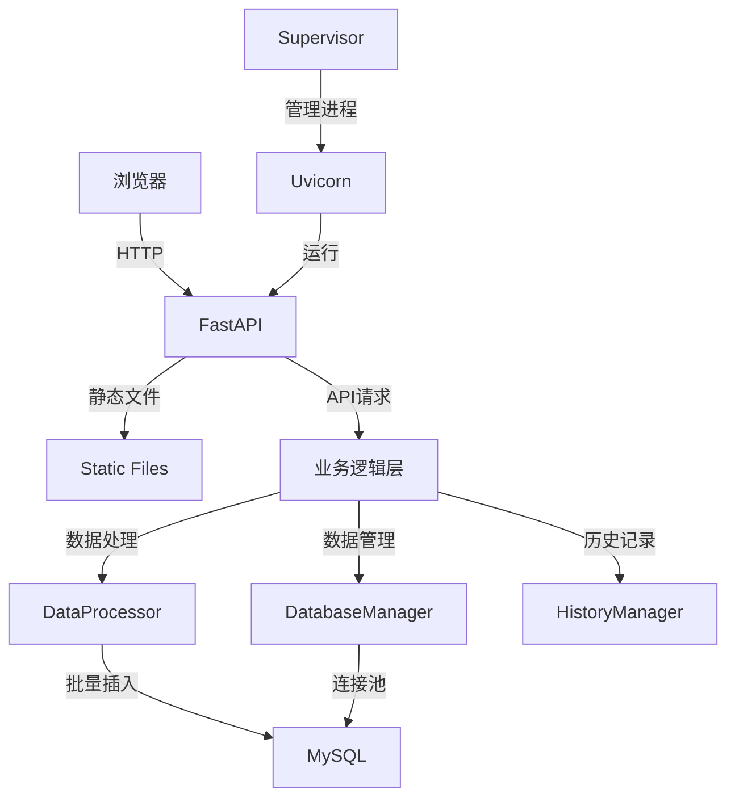
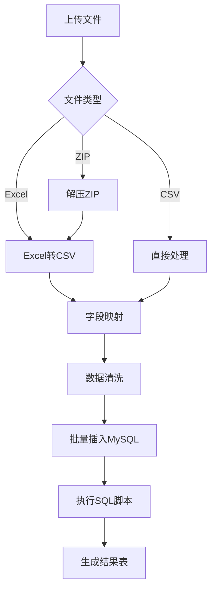
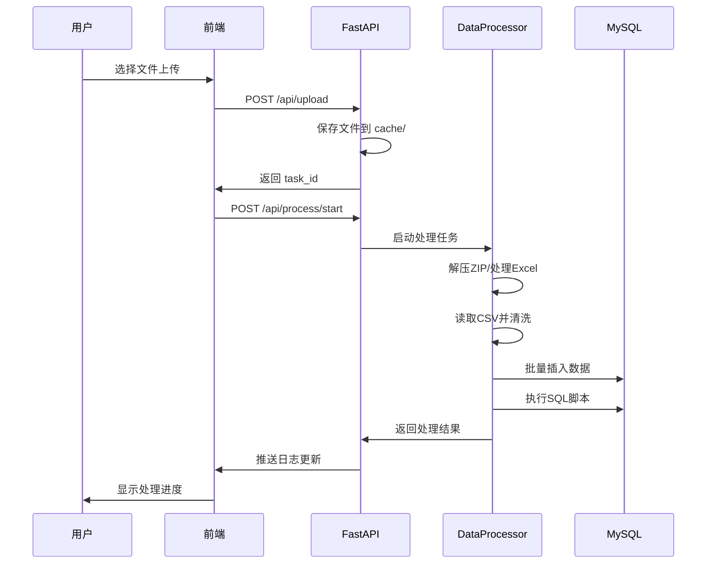

# CapacityReport - 容量报表处理程序

容量报表数据处理系统，支持 Excel/CSV 文件上传、数据提取、清洗和导入 MySQL 数据库。

## 技术栈

- **后端**: FastAPI + Uvicorn + Supervisor
- **前端**: 原生 JavaScript + HTML/CSS
- **数据库**: MySQL (PyMySQL + SQLAlchemy)
- **数据处理**: Pandas + OpenPyXL
- **部署**: Docker + Supervisor

## 系统架构



## 核心模块

- `app/main.py` - FastAPI 应用入口，API 路由
- `app/processor.py` - 数据处理核心（ZIP解压、Excel转CSV、CSV导入）
- `app/database.py` - 数据库连接与批量插入
- `app/history.py` - 处理历史记录管理
- `app/config.py` - 配置管理

## 数据流程



## 上传处理时序




## 部署

### Docker 部署

```bash
docker build -t capareport .
docker run -d --restart=always -p 9081:9081 capareport
```

### Windows 部署

```bash
# 安装依赖
pip install -r requirements.txt

# 启动服务（自动重启模式）
run.bat
```

### Linux 部署

```bash
# 使用 Supervisor
supervisord -c supervisord.conf
```

## 配置

配置文件: `Configure.json`

- `MySQL_DBInfo` - 数据库连接信息
- `SheetFilter` - Excel Sheet 过滤规则
- `ExtractField` - 字段映射配置

## API 端点

- `POST /api/upload` - 上传文件
- `POST /api/process/start` - 启动处理
- `POST /api/process/status` - 查询处理状态
- `POST /api/history` - 获取历史记录
- `POST /api/service/restart` - 重启服务
- `GET /api/service/status` - 服务状态

## 目录结构

```
CapaReport/
├── app/              # 应用代码
│   ├── main.py       # FastAPI 入口
│   ├── processor.py  # 数据处理
│   ├── database.py   # 数据库管理
│   ├── history.py    # 历史记录
│   └── config.py     # 配置管理
├── static/           # 前端静态文件
├── cache/            # 临时文件目录
├── Configure.json    # 配置文件
├── Dockerfile        # Docker 配置
└── supervisord.conf  # Supervisor 配置
```
