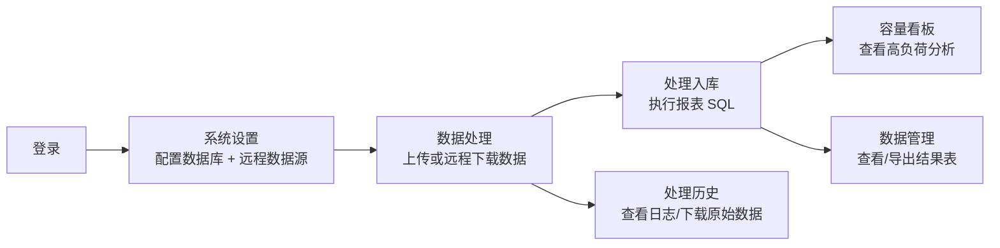

# CapacityReport 使用说明

本文面向使用者，介绍 Web 端各功能的操作方法与注意事项。系统的安装、运行与编译请见 [README](README.md)。

## 登录

- 启动服务后在浏览器访问 `http://localhost:9081`（桌面版直接打开应用窗口）。
- 默认账号：用户名 `root`，密码 `Capacity`。
- 登录后可在「系统设置 → 修改密码」修改密码。建议使用 Chrome / Edge 等现代浏览器。

## 整体使用流程

首次使用建议顺序：先在「系统设置」配好 MySQL 数据库，再在「数据处理」上传或下载数据，处理完成后到「容量看板」「数据管理」查看结果。

## 准备工作（系统设置）

正式处理数据前，至少要配置好数据库；使用远程自动下载时再配置远程数据源。

| 配置项 | 位置 | 说明 |
| --- | --- | --- |
| 数据库（数据仓库） | 系统设置 → 数据库 | 填写 MySQL 8.0+ 的主机、端口、库名、账号密码，保存后点「测试连接」确认可用 |
| CellData 数据库 | 系统设置 → 数据库 | 可选。若使用 CellData 小区信息，配置其数据库（可与主库相同或独立） |
| 远程数据源 | 系统设置 → 远程数据源 | 可选。配置 FTP/SFTP 服务器与目录，用于「远程下载并处理」 |
| 自动调度 | 系统设置 → 自动调度 | 可选。开启后系统按目标自然周自动检查远程数据并处理 |
| 字段映射 / Sheet 过滤 / 目录映射 | 系统设置 → 规则映射 | 配置源数据字段到目标字段的映射、Sheet 过滤规则、目录到暂存表的映射 |
| 处理历史保留 | 系统设置 → 数据库 | 可选。设置自动清理已结束历史、保留最近次数 |

> 提示：连接 FTP/SFTP 和 MySQL 的测试按钮会真实发起连接，若服务器较慢可能需要等待几秒。

## 功能页使用说明

### 数据处理

数据处理页提供「容量数据」和「CellData」两个区域，每个区域都支持本地上传与远程下载两种方式。每个卡片右上角有说明按钮，可查看所需文件格式。

| 操作 | 说明 |
| --- | --- |
| 本地上传（容量数据） | 拖拽或点击选择文件，支持 `.zip / .xlsx / .xls / .csv`，也可整文件夹上传 |
| 远程下载并处理（容量数据） | 从「系统设置」中配置的 FTP/SFTP 目录下载数据后自动处理 |
| CellData 上传 | 拖拽或选择**文件夹**（需包含 `700M`、`2.6G` 等频段子目录），不支持单个 ZIP 直接拖入 |
| CellData 远程下载并处理 | 按 CellData 数据源配置拉取并处理 |

处理过程的阶段会在进度区实时显示：

| 阶段 | 含义 |
| --- | --- |
| 远程下载中 | 从 FTP/SFTP 下载数据（仅远程方式） |
| 更新 CellData | 启用 CellData 数据源时，容量处理前先刷新小区信息 |
| 授权校验中 | 按数据日期校验授权期限 |
| 解压数据中 | 解压上传/下载的 ZIP |
| 转换 Excel 中 | 将 Excel 转换为 CSV |
| 导入数据中 | 数据写入 MySQL 暂存表 |
| 运行脚本中 | 执行 `ReportScript.sql` 生成结果表 |

> 注意：同一时间只能运行一个处理任务。任务运行时上传区会隐藏，只显示进度与日志，请等当前任务结束后再发起新任务。

### 容量看板

展示主数据库中 4G/5G 结果表的高负荷分析大屏，需先完成数据处理生成结果表。

| 区域 | 说明 |
| --- | --- |
| 制式切换 / 刷新 | 顶部切换 4G / 5G，点击刷新重新加载 |
| 汇总卡片 | 小区总数、高负荷数、各类预警、平均利用率、总流量等 |
| 图表 | 负荷问题分布、上下行利用率分布、制式 / 站型 / 频段统计等 |
| 问题小区清单 | 按高负荷优先排序，支持筛选、关键字搜索、分页与导出 CSV |
| 小区详情 | 点击清单某行打开右侧抽屉，查看关键指标、优化建议、同扇区小区 |

> 说明：未生成结果表时，看板显示「请先进行数据处理」。

### 处理历史

记录每次处理任务，便于回溯与排查。

| 操作 | 说明 |
| --- | --- |
| 查看详情 | 打开任务详情与分级处理日志 |
| 文件浏览 | 在详情中浏览该任务工作目录下的文件 |
| 下载 | 将历史原始数据打包为 ZIP 下载（任务完成后可用） |
| 删除 | 删除历史记录及其相关文件 |

### 数据管理

直接查看与维护数据库中的表，可在主数据库与 CellData 数据库之间切换。

| 操作 | 说明 |
| --- | --- |
| 选择数据库 / 表 | 表标题旁图标按钮切换数据库；左侧列表选择表 |
| 浏览数据 | 分页查看表数据，列宽可拖拽，可展开字段结构 |
| 编辑 / 删除行 | 每行可编辑或删除；编辑时清空某字段表示写入 NULL |
| 导出 | 导出当前表为 CSV，或选择多张表导出为同一个 XLSX |
| 模板 / 导入 | 下载当前表字段的 CSV 模板；导入要求表头与表字段完全一致 |
| 清空 / 删除表 | 清空表数据或删除整张表 |

> 注意：清空、删除表、删除行为不可恢复操作，请谨慎确认。

### 脚本编辑

在线编辑并执行业务 SQL，使用 Monaco 编辑器（带 SQL 高亮）。

| 操作 | 说明 |
| --- | --- |
| 切换脚本 | 顶部切换「容量报表脚本」（`ReportScript.sql`）和「CellData 脚本」（`CellData.sql`） |
| 保存 | 保存脚本，保存前会自动备份为 `.sql.bak` |
| 运行 | 在对应数据库上执行当前脚本，下方显示运行日志 |

> 说明：脚本运行也占用同一个任务锁，运行期间不能同时发起数据处理。

### 系统设置

| 标签页 | 内容 |
| --- | --- |
| 数据库 | 主仓库 MySQL、CellData 数据库、处理历史保留 |
| 远程数据源 | 容量数据 FTP/SFTP、CellData 数据源（含扫描路径、规则设置） |
| 自动调度 | 开关、检查间隔、目标周期、预期目录、调度状态 |
| 规则映射 | Sheet 过滤规则、字段映射、数据目录映射 |
| 修改密码 | 修改登录密码 |

页面顶部可下载 / 上传配置文件（`Configure.json`），方便备份与迁移。

## 注意事项

| 事项 | 说明 |
| --- | --- |
| 任务串行 | 数据处理、CellData 处理、脚本执行共用一个任务锁，同一时间只能运行一个，请勿并发触发 |
| 文件命名日期 | 容量数据 ZIP 文件名需含时间戳（`XXX_YYYYMMDDHHMM` 或 `XXX_YYYYMMDDHHMM_YYYYMMDDHHMM`），系统以**第一个**时间戳作为数据日期 |
| 每目录 7 天窗口 | 每个目录只保留并处理最近 7 个自然日的文件 |
| CellData 文件 | 来源为 `Result_300_*.zip`，时间取文件名末尾时间戳；本地上传必须按频段目录组织 |
| 授权期限 | 处理时按数据日期校验授权，超期会失败；可在弹出的激活框输入激活码延长 30 天 |
| 自动调度前提 | 开启自动调度会强制开启远程自动化与处理后删除源文件，请确认远程目录配置正确 |
| 数据安全 | 清空表、删除表、删除行、删除历史均不可恢复，操作前请确认 |
| 端口占用 | 服务默认使用 `9081` 端口，若被占用可在运行时指定其他端口 |
